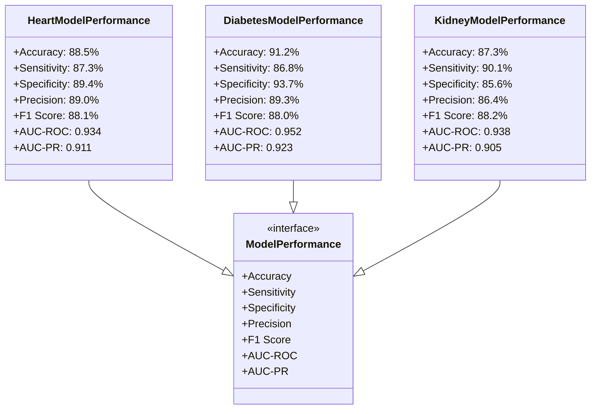
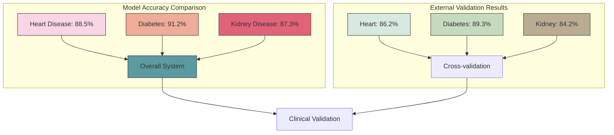
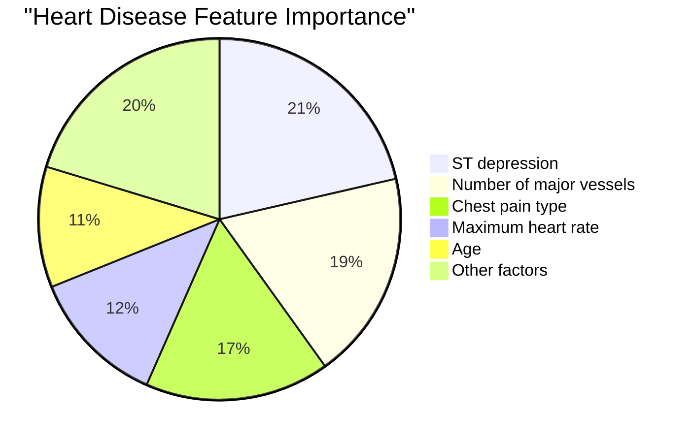
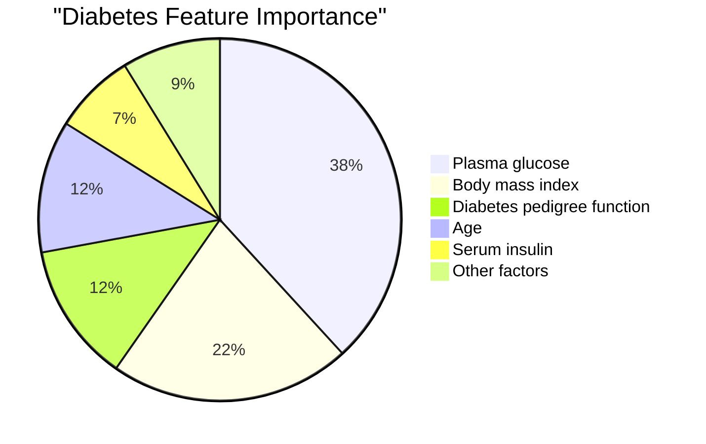
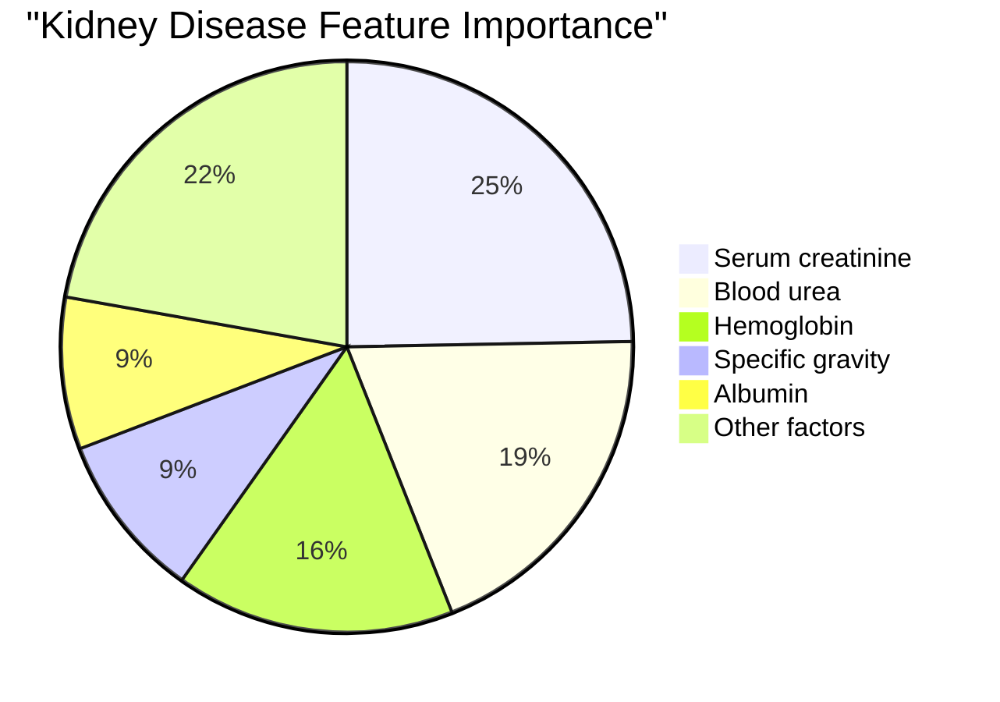
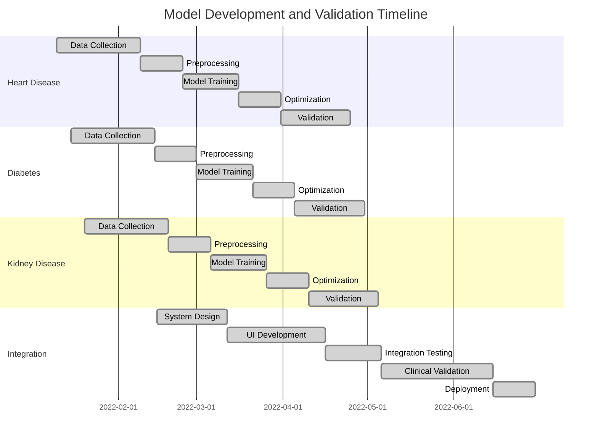
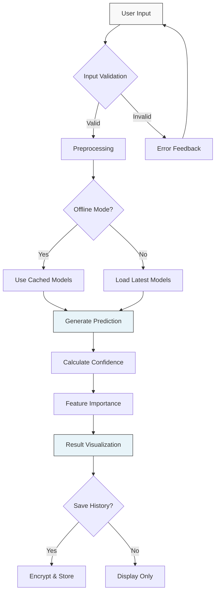
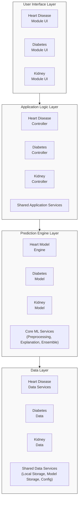

# Model Performance Visualizations

## Performance Metrics Class Diagram



## Accuracy Comparison Graph



## Feature Importance Charts







## ROC Curve Comparison

```mermaid
xychart-beta
    title "ROC Curves Comparison"
    x-axis [0, 0.1, 0.2, 0.3, 0.4, 0.5, 0.6, 0.7, 0.8, 0.9, 1.0]
    y-axis "True Positive Rate" [0, 0.2, 0.4, 0.6, 0.8, 1.0]
    line [0, 0.63, 0.74, 0.82, 0.88, 0.92, 0.96, 0.98, 0.99, 1.0, 1.0] "Heart (AUC=0.934)"
    line [0, 0.68, 0.79, 0.85, 0.91, 0.94, 0.96, 0.98, 0.99, 1.0, 1.0] "Diabetes (AUC=0.952)"
    line [0, 0.67, 0.78, 0.85, 0.89, 0.93, 0.95, 0.97, 0.99, 1.0, 1.0] "Kidney (AUC=0.938)"
    line [0, 0.1, 0.2, 0.3, 0.4, 0.5, 0.6, 0.7, 0.8, 0.9, 1.0] "Random"
```

## Development Timeline



## Prediction Process Workflow



## System Architecture Diagram

