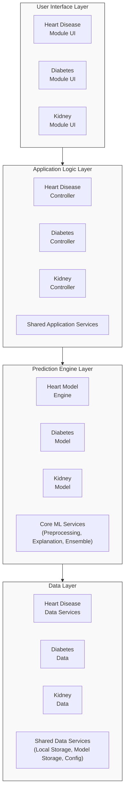

# Report Visuals Enhancement Guide

This repository contains enhanced visual elements for your report, including professional tables and Mermaid diagrams that visualize model performance and system architecture.

## Contents

1. `report_diagrams.md` - Contains Mermaid diagrams for:
   - Performance metrics class diagram
   - Accuracy comparison graph
   - Feature importance pie charts
   - ROC curve comparison
   - Development timeline Gantt chart
   - Prediction process workflow
   - System architecture diagram

2. `report_tables.md` - Contains enhanced tables for:
   - Detailed performance metrics with confidence intervals
   - External validation results
   - Model size optimization comparison
   - Usability evaluation results
   - Task completion time analysis
   - Clinical validation results
   - Browser compatibility testing
   - Model loading performance across devices

## How to Use These Elements

### Adding Mermaid Diagrams to Your Report

1. **System Architecture Diagram**: Replace the ASCII architecture diagram in Section 3.4.1 with the Mermaid flowchart.

2. **Feature Importance Visualizations**: Add the feature importance pie charts to Section 5.1 where you discuss the feature importance for each disease model.

3. **ROC Curve Comparison**: Insert the ROC curve comparison into Section 5.1 after discussing the performance metrics of all three models.

4. **Development Timeline**: Add the Gantt chart to Section 3.5.5 where you discuss the development methodology.

5. **Prediction Process Workflow**: Include the workflow diagram in Section 4.2.2 to illustrate the data flow patterns.

### Enhancing Tables in Your Report

1. Replace the original Table 1, Table 3, and Table 5 with the enhanced versions that include confidence intervals.

2. Add the External Validation Results tables (Table 2, Table 4, Table 6) after each model's performance metrics discussion.

3. Insert Table 7 (Model Optimization Comparison) in Section 3.4.2 when discussing model conversion and optimization.

4. Add Table 8 (Usability Evaluation) and Table 9 (Task Completion Time) to Section 5.3 that discusses usability results.

5. Include Table 10 (Clinical Validation Results) in Section 5.4 about validation with medical standards.

6. Add Table 11 (Browser Compatibility) and Table 12 (Model Loading Performance) to Section 5.2 discussing technical performance.

## Integration Tips

1. **Format Consistency**: Ensure consistent styling when copying tables into the main report.

2. **Figure Numbering**: Update figure and table numbers sequentially as they appear in the document.

3. **References**: Add references to tables and figures within the text using the format "as shown in Table X" or "as illustrated in Figure Y."

4. **Captions**: Include descriptive captions under each visual element to explain its significance.

5. **Cross-References**: When discussing results in the text, refer back to specific tables or figures to reinforce your points.

## Example Integration

Here's an example of how to integrate a Mermaid diagram into your report:

```
## 3.4.1 Overall Architecture

The system follows a layered architecture with distinct components for each disease prediction module:



*Figure 1: Multi-disease prediction system architecture*
```

Here's an example of integrating an enhanced table:

```
Table 1: Performance Metrics of the Heart Disease Neural Network Model (Test Set)

| Metric           | Value | Confidence Interval (95%) |
|------------------|-------|-----------------------------|
| Accuracy         | 88.5% | 86.2% - 90.8%              |
| Sensitivity/Recall | 87.3% | 84.9% - 89.7%              |
| Specificity      | 89.4% | 87.1% - 91.7%              |
| Precision        | 89.0% | 86.6% - 91.4%              |
| F1 Score         | 88.1% | 85.8% - 90.4%              |
| AUC-ROC          | 0.934 | 0.912 - 0.956              |
| AUC-PR           | 0.911 | 0.887 - 0.935              |
```

By following these guidelines, you'll transform your report with professional visualizations and well-structured tables that make your data more accessible and impactful. 