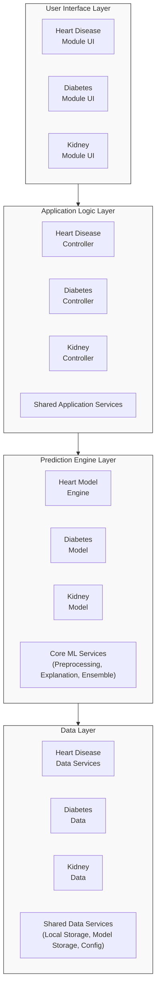

```mermaid
flowchart TD
    %% Define the layers as subgraphs
    subgraph UILayer["User Interface Layer"]
        HeartUI["Heart Disease\nModule UI"]
        DiabetesUI["Diabetes\nModule UI"]
        KidneyUI["Kidney\nModule UI"]
    end

    subgraph AppLayer["Application Logic Layer"]
        HeartController["Heart Disease\nController"]
        DiabetesController["Diabetes\nController"]
        KidneyController["Kidney\nController"]
        SharedServices["Shared Application Services"]
    end

    subgraph PredictionLayer["Prediction Engine Layer"]
        HeartEngine["Heart Model\nEngine"]
        DiabetesEngine["Diabetes\nModel"]
        KidneyEngine["Kidney\nModel"]
        CoreMLServices["Core ML Services\n(Preprocessing, Explanation, Ensemble)"]
    end

    subgraph DataLayer["Data Layer"]
        HeartData["Heart Disease\nData Services"]
        DiabetesData["Diabetes\nData"]
        KidneyData["Kidney\nData"]
        SharedDataServices["Shared Data Services\n(Local Storage, Model Storage, Config)"]
    end

    %% Connect the layers
    UILayer --> AppLayer
    AppLayer --> PredictionLayer
    PredictionLayer --> DataLayer

    %% Style the diagram
    classDef layerStyle fill:#f9f9f9,stroke:#333,stroke-width:1px
    class UILayer,AppLayer,PredictionLayer,DataLayer layerStyle
``` 