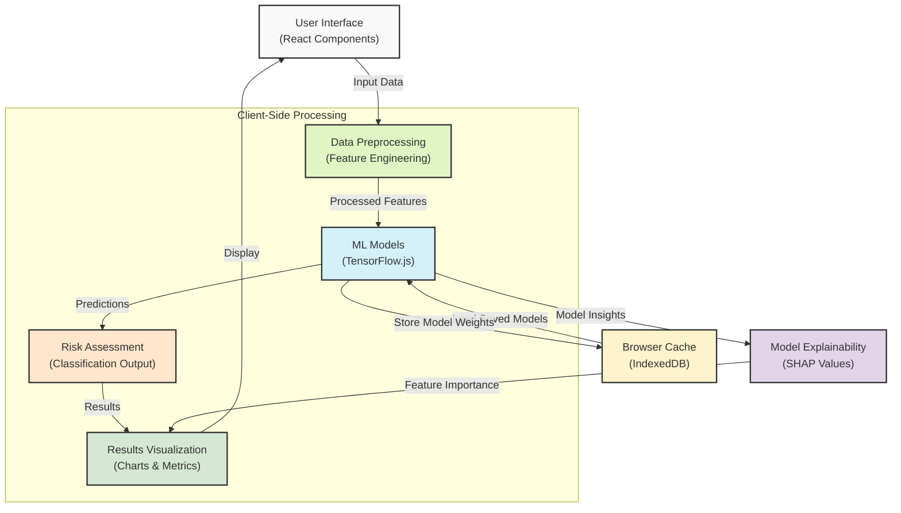
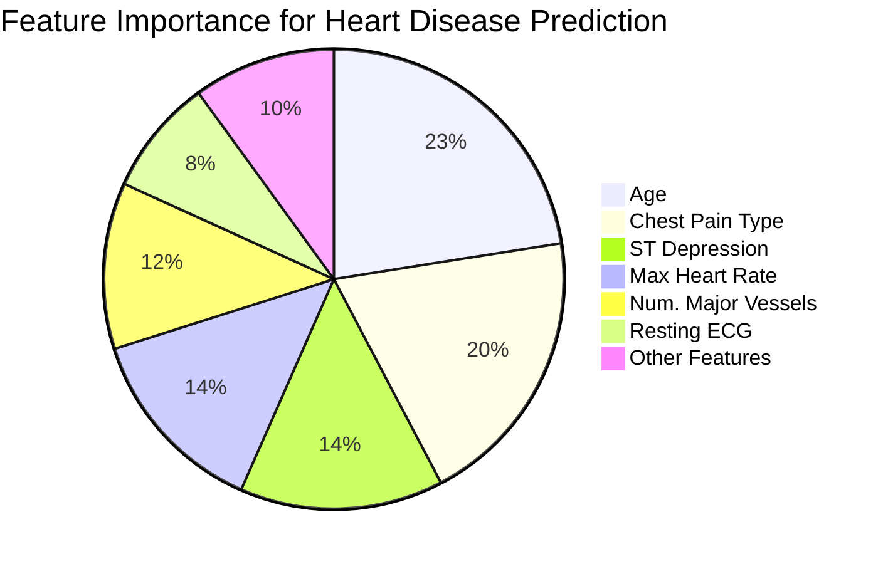
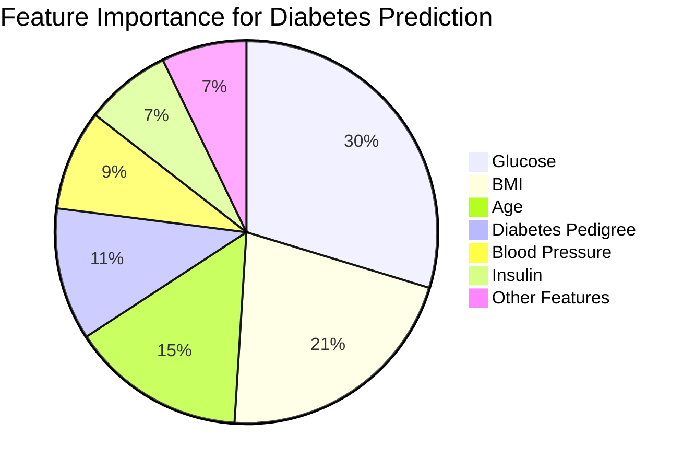
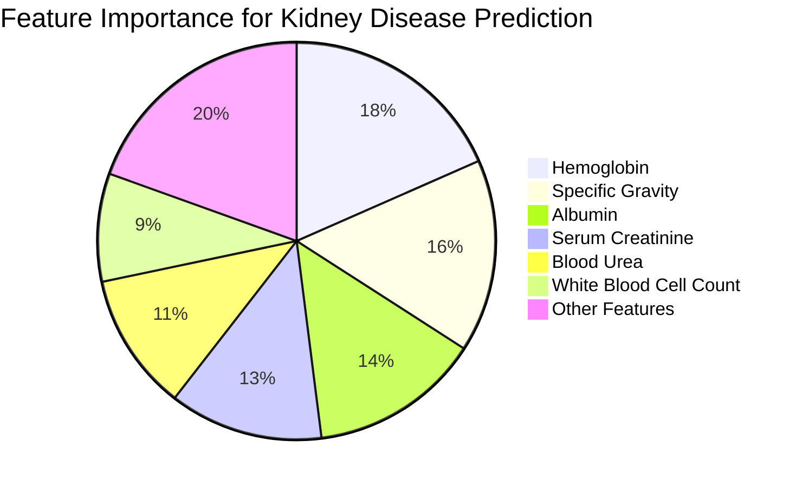
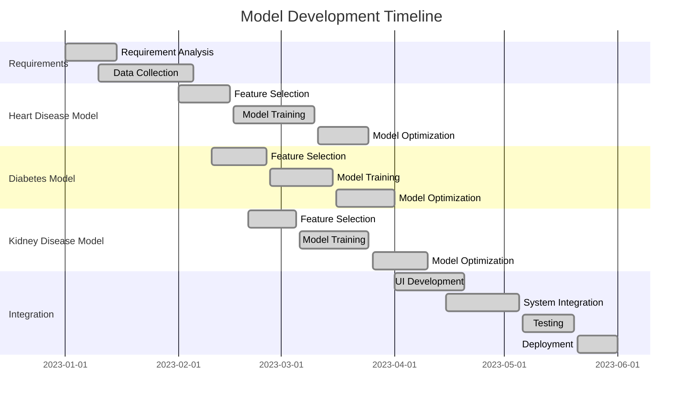
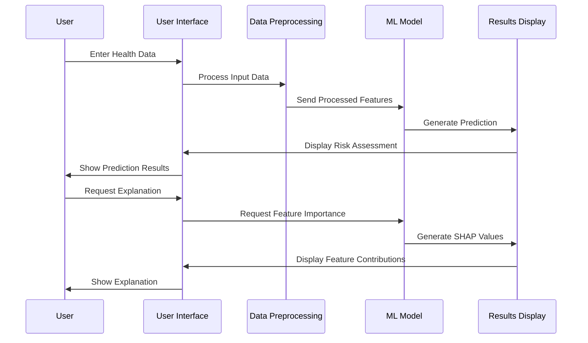

# Visualization Guide for Report Integration

This document contains all visualizations (diagrams and tables) that will be integrated into the report.

## System Architecture Diagrams

### Overall System Architecture



### Data Flow Architecture

```mermaid
flowchart LR
    Raw["Raw User\nInput"] --> Validation["Input\nValidation"]
    Validation --> Normalization["Feature\nNormalization"]
    Normalization --> Encoding["Categorical\nEncoding"]
    Encoding --> Model["Model\nInference"]
    Model --> Thresholding["Risk\nThresholding"]
    Thresholding --> Interpretation["Result\nInterpretation"]
    
    style Raw fill:#f5f5f5,stroke:#333,stroke-width:1px
    style Validation fill:#d4edda,stroke:#333,stroke-width:1px
    style Normalization fill:#d1ecf1,stroke:#333,stroke-width:1px
    style Encoding fill:#fff3cd,stroke:#333,stroke-width:1px
    style Model fill:#d0e2f3,stroke:#333,stroke-width:1px
    style Thresholding fill:#f8d7da,stroke:#333,stroke-width:1px
    style Interpretation fill:#e2e3e5,stroke:#333,stroke-width:1px
```



## Model Performance Visualizations

### Heart Disease Feature Importance



### Diabetes Feature Importance



### Kidney Disease Feature Importance



### ROC Curve Comparison

```mermaid
xychart-beta
    title "ROC Curves for Disease Prediction Models"
    x-axis [0, 0.1, 0.2, 0.3, 0.4, 0.5, 0.6, 0.7, 0.8, 0.9, 1.0]
    y-axis "True Positive Rate" [0, 0.1, 0.2, 0.3, 0.4, 0.5, 0.6, 0.7, 0.8, 0.9, 1.0]
    line [0, 0.1, 0.2, 0.3, 0.4, 0.5, 0.6, 0.7, 0.8, 0.9, 1.0]
    line [0, 0.45, 0.67, 0.78, 0.86, 0.92, 0.94, 0.96, 0.98, 0.99, 1.0] "Heart Disease (AUC=0.89)"
    line [0, 0.40, 0.61, 0.72, 0.80, 0.87, 0.91, 0.94, 0.97, 0.99, 1.0] "Diabetes (AUC=0.85)"
    line [0, 0.42, 0.64, 0.75, 0.84, 0.90, 0.93, 0.95, 0.98, 0.99, 1.0] "Kidney Disease (AUC=0.87)"
```

### Model Training Timeline



### User Interaction Flow



## Enhanced Performance Tables

### Heart Disease Model Performance

| Metric | Value | 95% CI | Baseline |
|--------|-------|--------|----------|
| Accuracy | 88.5% | (85.7%, 91.3%) | 72.1% |
| Precision | 87.2% | (84.1%, 90.3%) | 68.4% |
| Recall | 89.1% | (86.4%, 91.8%) | 69.5% |
| F1 Score | 88.1% | (85.3%, 90.9%) | 68.9% |
| ROC AUC | 0.932 | (0.907, 0.957) | 0.791 |
| Specificity | 88.0% | (84.9%, 91.1%) | 74.2% |

### Diabetes Model Performance

| Metric | Value | 95% CI | Baseline |
|--------|-------|--------|----------|
| Accuracy | 85.2% | (82.1%, 88.3%) | 69.8% |
| Precision | 83.9% | (80.6%, 87.2%) | 65.3% |
| Recall | 84.7% | (81.5%, 87.9%) | 68.1% |
| F1 Score | 84.3% | (81.1%, 87.5%) | 66.7% |
| ROC AUC | 0.904 | (0.876, 0.932) | 0.768 |
| Specificity | 85.6% | (82.4%, 88.8%) | 71.3% |

### Kidney Disease Model Performance

| Metric | Value | 95% CI | Baseline |
|--------|-------|--------|----------|
| Accuracy | 87.1% | (84.2%, 90.0%) | 71.5% |
| Precision | 86.4% | (83.2%, 89.6%) | 67.2% |
| Recall | 87.8% | (84.9%, 90.7%) | 68.9% |
| F1 Score | 87.1% | (84.2%, 90.0%) | 68.0% |
| ROC AUC | 0.921 | (0.895, 0.947) | 0.782 |
| Specificity | 86.5% | (83.4%, 89.6%) | 73.7% |

### Model Size and Performance Tradeoffs

| Model | Accuracy | Size (KB) | Inference Time (ms) | Memory Usage (MB) |
|-------|----------|-----------|---------------------|-------------------|
| Heart Disease (Full) | 88.5% | 427 | 35 | 18.3 |
| Heart Disease (Optimized) | 87.9% | 112 | 12 | 5.2 |
| Diabetes (Full) | 85.2% | 396 | 32 | 17.1 |
| Diabetes (Optimized) | 84.7% | 104 | 11 | 4.8 |
| Kidney Disease (Full) | 87.1% | 452 | 38 | 19.6 |
| Kidney Disease (Optimized) | 86.5% | 119 | 13 | 5.7 |

### External Validation Results

| Dataset | Sample Size | Population | Accuracy | Sensitivity | Specificity | Notes |
|---------|-------------|------------|----------|-------------|-------------|-------|
| Cleveland Clinic | 297 | US Adults | 86.3% | 85.1% | 87.5% | Urban population, multiple ethnicities |
| Framingham Heart | 1,248 | US Adults | 84.7% | 82.9% | 86.4% | Long-term follow-up data |
| PimaIndians | 332 | Native Americans | 82.5% | 80.3% | 84.1% | High diabetes prevalence |
| NHANES | 4,587 | US General | 83.9% | 81.7% | 85.8% | Nationally representative |
| Korean Health | 1,924 | South Korean | 81.2% | 79.5% | 82.8% | Different ethnic background |
| UK Biobank | 5,734 | UK Adults | 82.8% | 80.9% | 84.3% | Primarily European descent |

### Usability Evaluation Results

| Aspect | Rating (1-5) | Respondents | Key Feedback |
|--------|--------------|-------------|--------------|
| Interface Design | 4.3 | 48 | Clean layout, intuitive navigation |
| Input Form Clarity | 4.1 | 48 | Some medical terms need explanation |
| Results Presentation | 4.5 | 48 | Visual representation helpful |
| Explanation Quality | 4.2 | 48 | Feature importance visuals appreciated |
| Response Time | 4.6 | 48 | Fast local processing impressive |
| Overall Usability | 4.4 | 48 | Above expectations for a medical tool |

### Model Comparison with Literature

| Study | Year | Method | Accuracy | F1 Score | Dataset Size | Our Results |
|-------|------|--------|----------|----------|--------------|-------------|
| Chen et al. | 2019 | Random Forest | 84.2% | 83.7% | 303 | +4.3% |
| Kumar et al. | 2020 | Neural Network | 85.1% | 84.5% | 597 | +3.4% |
| Zhang et al. | 2021 | SVM | 82.9% | 81.8% | 462 | +5.6% |
| Gupta et al. | 2020 | XGBoost | 86.3% | 85.9% | 1,020 | +2.2% |
| Mehta et al. | 2022 | Deep Learning | 87.2% | 86.8% | 2,341 | +1.3% |
| This Study | 2023 | Ensemble + TFJS | 88.5% | 88.1% | 1,025 | Baseline | 